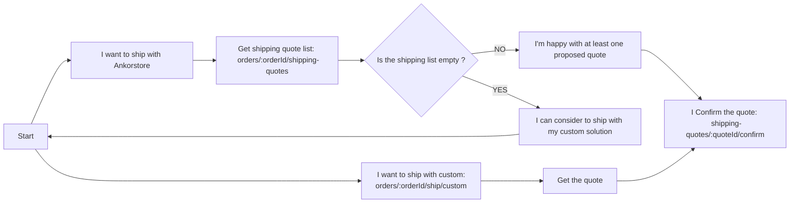
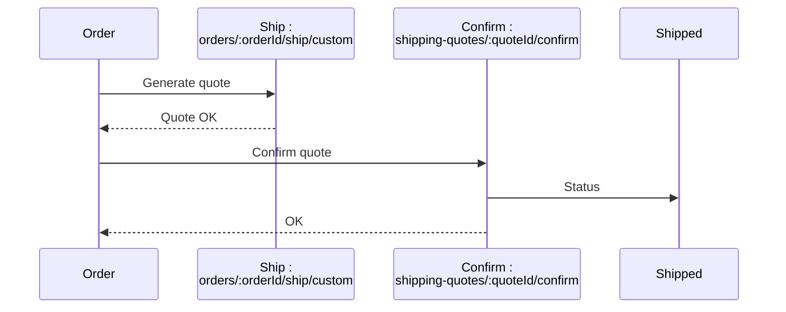
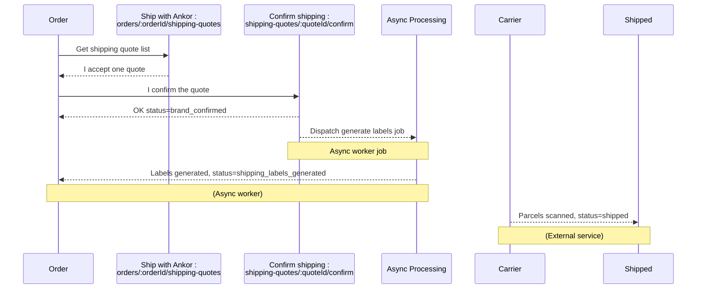

# Shipping an Order

When shipping with either method `ankorstore` or `custom` the brand must provide the parcel data it intends to ship the products in. This parcel information is required when generating quote with either shipping method:

- For custom method : 
  - Get the quote : `/v1/orders/:orderId/ship/custom`
  
- For ankorstore method : 
    - Get quote list : `/v1/orders/:orderId/shipping-quotes`

Once the quote is generated, the brand must confirm the selected one by calling :
- For custom method :
    - Confirm shipping : `/v1/shipping-quotes/:quoteId/confirm`

- For ankorstore method :
    - Confirm shipping : `/v1/shipping-quotes/:quoteId/confirm`

<!-- theme: info -->

> #### What is the difference between the 2 methods?
>
> **Ankorstore** : For this option, Ankorstore will pre-select the best carrier option for you after you’ve entered the parcel weight and size based on a competitive quotation offer.  
> Once the offer is selected a label will be generated and available in order payload
> 
> **Custom** : With this option, you use your preferred carrier and get a reimbursement from us based on our freight costs.
> 
> To find out more about Ankorstore's shipping options, please [visit our FAQs.](https://ankorstoresas.my.site.com/faq/s/article/what-shipping-options-are-available-with-ankorstore?language=en_US)


The brand can generate many quotes between both providers or a single one with different parcel configurations before they decide to **confirm** the quote. An example flow:



## Shipping Methods

Within the `shippingOverview` object, there is a field that holds the supported shipping methods for an order:

```json
{
  "status": "brand_confirmed",
  ...
  "shippingOverview": {
    "availableShppingMethods": ["custom", "ankorstore"]
  }
}
```

Please check this before attempting to ship with ankorstore as it may not be available.

<!-- theme: warning -->

> #### Parcels
>
> On either shipping method, if the brand has previously generated a quote and is now generating a new one the full list of parcels must be provided. The quote endpoint **cannot** be called with an empty parcel list to re-use the old parcel data.

<!-- theme: danger -->

> #### Confirming a quote
>
> To confirm a quote, the ID must be provided when calling the `/v1/shipping-quotes/:quoteId/confirm` endpoint.

Apart from `shippingMethod` that is at the order resource level, all information regarding shipping and tracking is stored within the `shippingOverview` object. This includes the `latestQuote` generated and the `shippingCostsOverview`.

## Shipping Costs Overview

<!-- theme: warning -->

> We advise you to pay attention on the shippingCostsOverview object, especially when type=fee as the amount referenced here will be subtracted from the brandTotalAmount.

In the `latestQuote` object, an object called `shippingCostsOverview` might appear depending on the shipping method selected.
This object includes the cost of the shipping and the type of the cost :

Fee payload example :

```json
{
  "shippingCostsOverview": {
    "amount": 5160,
    "currency": "EUR",
    "type": "fee"
  }
}
```

Refund payload example :

```json
{
  "shippingCostsOverview": {
    "amount": 1060,
    "currency": "EUR",
    "type": "refund"
  }
}
```

If the type is **fee**, it means that this amount will be subtracted from brand net amount as a contribution to shipping costs. If the type is **refund**, the amount will be refunded to the brand.

In the new endpoint for listing quotes `v1/orders/:orderId/shipping-quotes`, the shipping cost of the selected quote will be the fee subtracted from total amount (here 8.07 euros):
```json
{
    "quoteUuid": "1edd47df-b91a-68b0-b517-52e73cd28d4f",
    "carrierCode": "ups",
    "serviceCode": "11",
    "serviceCommercialName": "UPS Standard",
    "collectionMethod": [
        "pickup",
        "drop-off"
    ],
    "shippingCost": {
        "amount": 807,
        "currency": "EUR"
    }
}
```

<!-- theme: info -->

> #### Want more information about shipping contribution?
>
> To find out more about Ankorstore's contribution to your shipping costs, please [visit our FAQs.](https://knowledgecommunity.force.com/faq/s/article/shippingpolicy?language=en_US)

## Shipping with the brands own carrier

The quote action will return an amount that will be refunded back to the brand based on the shipping grid refund matrix.

The confirm action is synchronous, meaning when the action is called the order resource will have its status changed to `shipped` upon returning a response. It is up to brand to provide tracking details for the retailer when calling this action.



<!-- theme: info -->

> In the ship/custom endpoint response, the quote uuid generated is returned in the latestQuote part:
> ```json
> {
>   "latestQuote": {
>     "id": "1edd395f-5b57-62ac-9698-521a54b4405f",
>     "provider": "custom",
>     ...
>   }
> }
> ```

## Shipping with Ankorstore (asynchronous)

When calling the confirm action for the order's Ankorstore shipping quote, the returned order resource's status will still be `brand_confirmed`. A job in the background will generate the shipping labels for the order. It is this background processing that moves the status to `shipping_labels_generated`.

<!-- theme: info -->

> #### How will I know when the labels have been generated?
>
> Right now, the order must be polled periodically. Checking every minute would be suitable to detect the status change and then pull the label PDF data within [shipping overview](spec/v1.yaml/components/schemas/orderShippingOverview).



At step 6 (shipping labels generated) the download URL's for each packages label will be available within [shipping overview](spec/v1.yaml/components/schemas/orderShippingOverview). These labels are in PDF format and will also be visible in order details page on Ankorstore.

### Schedule a Pickup

If the brand is not taking the parcels to the local drop-off point for the carrier the brand can schedule a pickup for this order. A pickup can only be scheduled on a working day (monday to friday). For full information please refer to the API documentation.

<!-- theme: info -->

> #### Pickup is not accepted
>
> For now, Ankorstore does not know in advance which date/time configuration is available, if the requested pickup is denied please try a different date or time frame.
