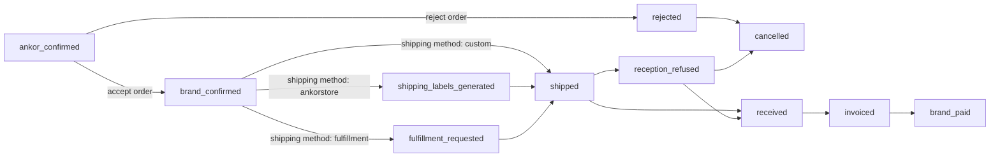

# Working with Orders

Here you will find information about the order resource and it's sub-resources. If you need further information please refer to the API specification.

## Including order items, retailer and other information

When retrieving the individual order via the API, you may find it lacking in certain information such as retailer, order items etc.

<!-- theme: info -->
> #### Includes
>
> For every endpoint that returns the order resource you may pass an `?include=` query parameter that will return extra information inside the `included` root level object.
>
> The supported resources to include are `retailer`, `billingItems`, `orderItems`, `orderItems.productOption`, `orderItems.productOption.product`, `orderItems.productVariant` and `orderItems.productVariant.product`.
>
> Please note that, if you include `orderItems.productOption` you do not need to specify `orderItems` separately. It will be automatically included.
>
> As an example, to include all data possible you would do `?include=retailer,billingItems,orderItems.productOption.product`

## Important Fields within Order Resource

If the field contains no data, it will be `null`. The only exception currently to this is `shippingOverview` which can be viewed below. The fields listed below are not all of the fields, please see the API specification for all of them.

### Status `status`

The status field is the current state of the order, below is a table that describes each step:

| Status                      | Description                                                                                                                                                                                                                               |
|-----------------------------|-------------------------------------------------------------------------------------------------------------------------------------------------------------------------------------------------------------------------------------------|
| `ankor_confirmed`           | The order has been confirmed by Ankorstore and now a decision can be made whether to accept or reject this order.                                                                                                                         |
| `rejected`                  | The order has been rejected, Ankorstore needs to approve this rejection. If it does, the status will moved to `cancelled`.                                                                                                                |
| `brand_confirmed`           | The order has been accepted. it now needs to be shipped to the retailer.                                                                                                                                                                  |
| `shipping_labels_generated` | The order has been shipped with Ankorstore and the labels have been generated - these are now available in the order resource data within `shippingOverview`.                                                                             |
| `fulfillment_requested`     | The brand has chosen to fulfill the order, or the order was automatically fulfilled. The order will remain in this state until it has been fulfilled by the fulfillment provider.                                                         |
| `shipped`                   | The order has either been picked up by an Ankorstore carrier (e.g UPS) or the brand has chosen to ship with their own carrier.                                                                                                            |
| `received`                  | The retailer has received the package, if shipped with Ankorstore this is automatic from the carrier otherwise for custom shipping the retailer has to manually acknowledge this.                                                         |
| `reception_refused`         | The retailer has refused the reception of the package - if Ankorstore approves the reason the order will move to cancelled. The status can also move to `received` if the retailers issues have been resolved by the brand or Ankorstore. |
| `invoiced`                  | The final invoice has been issued for this order.                                                                                                                                                                                         |
| `brand_paid`                | The brand has been paid in full for this order.                                                                                                                                                                                           |
| `cancelled`                 | The order is cancelled.                                                                                                                                                                                                                   |

<!-- theme: warning -->
> #### Not to be confused: Status vs Shipping Flow
> The above diagram shows what status the order will be in **based** on the actions performed in the API. The most confusing may be the shipping flow. To reach the `shipped` or `shipping_labels_generated` status, a shipping quote must always be generated and then confirmed. Please see [shipping an order](/docs/ankorstore-api/pages/order/shipping-an-order.md) for further details.

### Shipping Method `shippingMethod`

What shipment method has been chosen for this order. Either `ankorstore` for using Ankorstores shipping service,
`custom` for using the brand's own carrier or `fulfillment` if the order is shipped from a fulfillment centre
This field is `null` when no choice has yet been made.

### Shipping Overview `shippingOverview`

<!-- theme: warning -->
> #### Field Availaiblity
>
> The object `shippingOverview` is only available when retrieving a single order. This data is not available when retrieving a list of orders.

### Submitted At `submittedAt`

This is the date the retailer submitted their whole order.

### Shipped At `shippedAt`

This is when the brand shipped the order.

### Brand Paid At `brandPaidAt`

This is when Ankorstore pays the brand, if it is `null` then payment is still pending.
